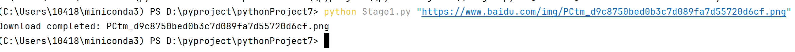
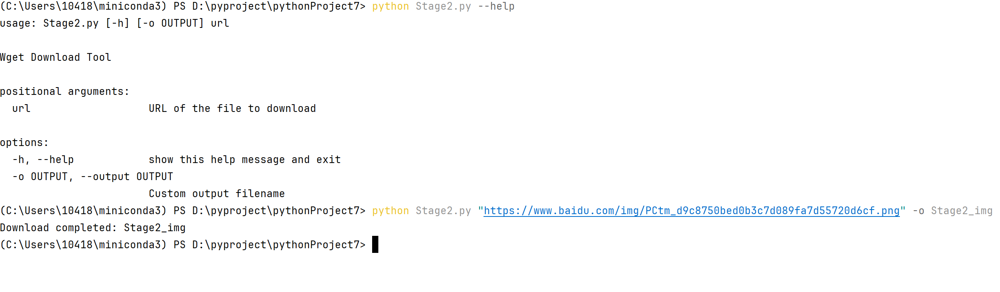
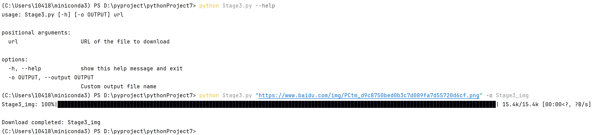
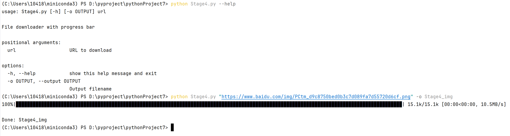
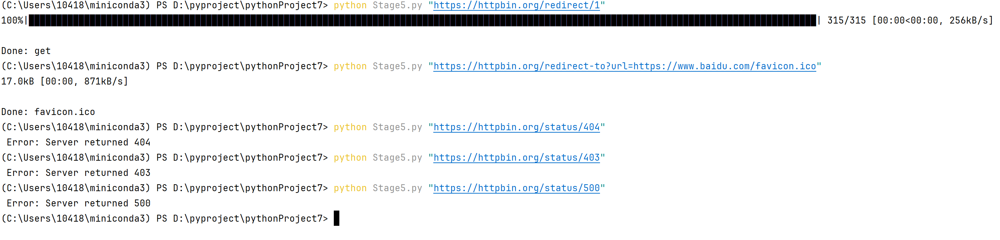
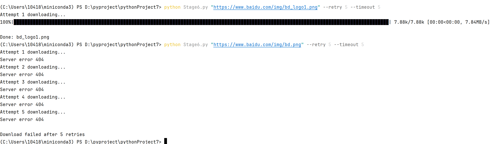
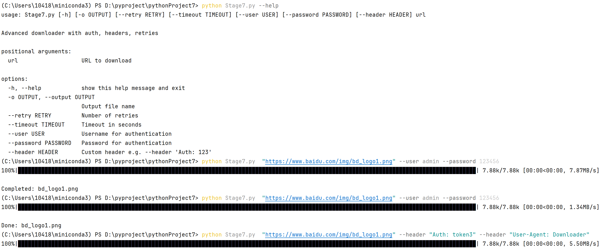
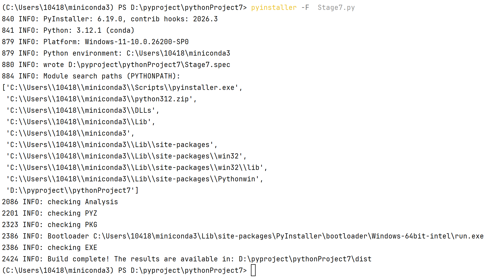
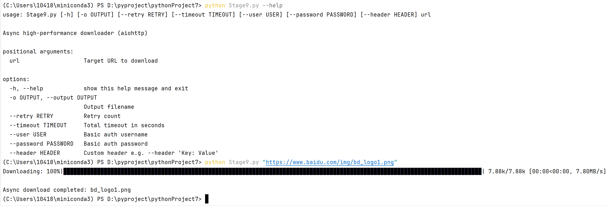

# Python Wget Clone
A step-by-step implementation of the Linux `wget` tool in Python, across 9 stages.

---

## Stage 1: Basic Download
**Function**: Simplest file download (no extra features)

---

## Stage 2: Custom Output Filename `-o` / `--output`
**Function**: Allow users to specify the output filename via command line arguments

---

## Stage 3: Progress Bar
**Function**: Show real-time progress of downloaded bytes

---

## Stage 4: Download Speed + ETA (Estimated Time of Arrival)
**Function**: Display download speed (KB/s / MB/s) and estimated remaining time

---

## Stage 5: Redirects + Error Code Handling (404/500/403)
**Function**: Automatically follow HTTP redirects and handle common error codes (404 Not Found, 500 Server Error, 403 Forbidden)

---

## Stage 6: Retry Mechanism `--retry` + Timeout
**Function**: Add configurable retry attempts (`--retry N`) and request timeout

---

## Stage 7: HTTP Auth + Custom Headers `--user` `--password` `--header`
**Function**: Support HTTP Basic Authentication and custom request headers

---

## Stage 8: Package to EXE Binary File
**Function**: Compile the Python script into a standalone Windows executable (using PyInstaller / cx_Freeze / py2exe)

---

## Stage 9: Async Download + 128KB Buffer Optimization
**Function**: Implement asynchronous download (aiohttp) with 128KB buffer size for optimal performance, separating progress bar from file I/O

